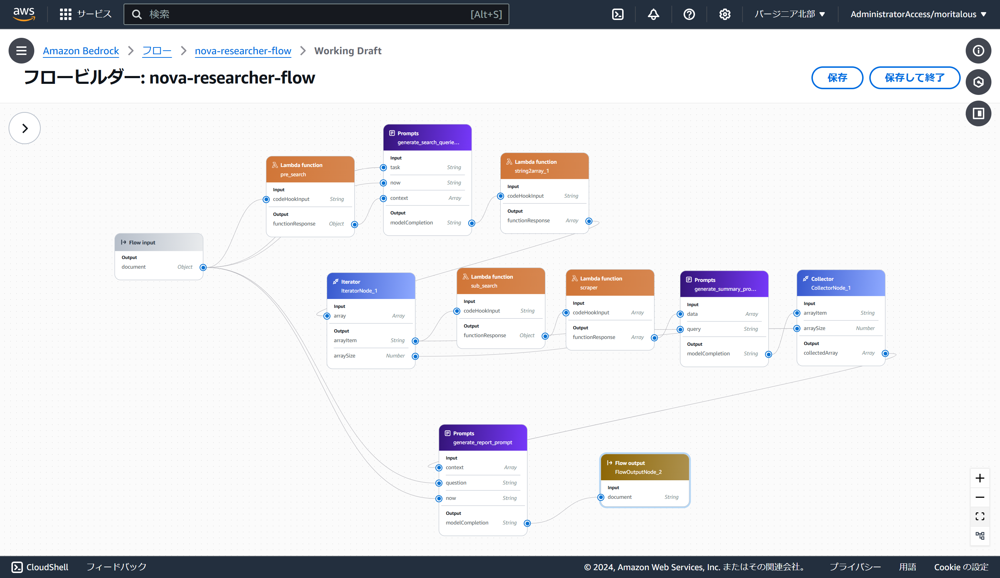

# Nova Researcher

Nova Researcher is an app built with Bedrock Flow inspired by GPT Researcher.

## 前提条件

* バージニア北部リージョンを使用する想定です。
* TavilyのAPIキーを用意してください。
* Amazon Nova Micro、Lite、ProをUSのクロスリージョン推論を使用します。3モデルのモデルアクセスをバージニア北部、オレゴン、オハイオリージョンで有効化してください。

## デプロイ手順

1. SSMパラメーターストアにTavilyのAPIキーをSecureString形式で登録します。パラメーター名は`/nova_researcher/tavily_api_key`です。（app-stack.ts内でハードコード）
1. `cdk deploy`を実行します。

`frontend`ディレクトリにStreamlitで構築したデモ画面を用意しています。

---

The `cdk.json` file tells the CDK Toolkit how to execute your app.

## Useful commands

* `npm run build`   compile typescript to js
* `npm run watch`   watch for changes and compile
* `npm run test`    perform the jest unit tests
* `npx cdk deploy`  deploy this stack to your default AWS account/region
* `npx cdk diff`    compare deployed stack with current state
* `npx cdk synth`   emits the synthesized CloudFormation template
